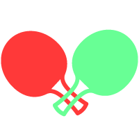

 
 
  

<h1 align="center">Tenis Game</h1>

Tennis game created with HTML Canvas and JavaScript.

## :clipboard: Table of contents 
* [General info](#information_source-general-info)
* [Screenshots](#camera-screenshots)
* [Technologies](#computer-technologies)
* [Features](#bulb-features)
* [Status](#question-status)

## :information_source: General info  
Tennis game started with an unfinished youtube tutorial of a basic tennis game. [link](https://www.youtube.com/watch?v=8IJ_1QcqMdM&list=PLTs20Q-BTEMMSpaBeLpGECE3748o2MOFD). I set up my own design, added popups,local storage and more features. 
[:arrow_forward:](https://martaniemiec.github.io/Pong_game/)

## :camera: Screenshots  

 

 

 

## :computer: Technologies  
* HTML5 Canvas 
* CSS
* JavaScript

## :bulb: Features  
* Choosing level of the game
* Setting up how high should be the winning score in the upcoming round
* Storing scores in the local storage
* Reseting scores
* Displaying winner/looser popup with a specific sound

## :question: Status  
Project no longer continued. :zzz: 

## Acknowledgements
* [Sounds](http://www.findsounds.com)
* [Digital font](https://www.dafont.com/digital-7.font)
* [Fontawesome](https://fontawesome.com/)
* [Backgroud pattern](https://www.patterncooler.com/#a96b96c12Cd12Ce0f0g64h25536E538AC0i39j0k0l1F4m1F4)
